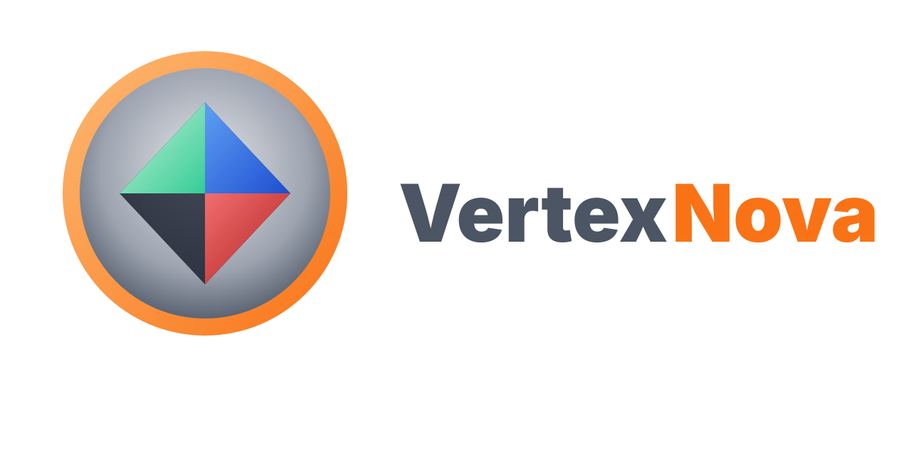

<p align="center">
  
</p>

<p align="center">
  <strong>3D Gaussian Splatting for the VertexNova ecosystem, built from first principles</strong>
</p>

<p align="center">
  <a href="https://github.com/vertexnova/vne3dgs/actions/workflows/ci.yml">
    
  </a>
  
  <a href="https://codecov.io/gh/vertexnova/vne3dgs">
    
  </a>
  
</p>

---

# Vne3dgs

**vne3dgs** (`vne::gs`) is a C++20 library that implements 3D Gaussian Splatting (3DGS) on the
[VertexNova](https://github.com/vertexnova) stack, step by step: the math and a CPU reference
renderer first, then a real-time GPU renderer on [vnerhi](https://github.com/vertexnova/vnerhi)
(Metal / Vulkan / WebGPU), then training.

It is also a learning project. Every step is a task file with its own learning material.
**Start here: [docs/vertexnova/gs/roadmap.md](docs/vertexnova/gs/roadmap.md).**

> The earlier Python prototype (a thin wrapper around gsplat) is preserved at git tag `python-prototype`.

## Status

| Phase | What | Status |
|-------|------|--------|
| 0 | Scaffold (this repo layout, build, CI) | done |
| 1–3 | 3DGS math + CPU reference renderer | not started |
| 4 | Real-time GPU viewer (vnerhi) | not started |
| 5 | Training (COLMAP, PyTorch, gsplat, own backward pass) | not started |
| 6 | vnegfx integration (optional) | not started |

Per-task status lives in the [roadmap](docs/vertexnova/gs/roadmap.md).

## Directory layout

| Path | Description |
|------|-------------|
| `include/vertexnova/gs/` | Public API headers (`gs.h` is the umbrella header) |
| `src/vertexnova/gs/` | Implementation |
| `tests/` | Unit tests (Google Test) |
| `testdata/` | Tiny hand-made fixtures for tests (committed; real scenes are not) |
| `examples/` | One example per learning task (`00_hello_gs`, `01_gaussians_2d`, …) |
| `docs/vertexnova/gs/` | Roadmap, task files, learning notes, glossary, references |
| `cmake/vnecmake/` | Shared CMake modules (submodule) |
| `deps/internal/` | VertexNova libs: vnecommon, vnelogging, vnemath (submodules) |
| `deps/external/` | Third-party deps: googletest (submodule) |
| `configs/` | Configured headers (`config.h.in`) |
| `scripts/` | Build, format and docs scripts |

## Prerequisites

- **CMake** 3.19 or newer
- **C++20** compiler (GCC 10+, Clang 10+, MSVC 2019+)
- **Doxygen** (optional, for API docs)

## Getting the code

```bash
git clone --recursive https://github.com/vertexnova/vne3dgs.git
# or, in an existing clone:
git submodule update --init --recursive
```

See [deps/README.md](deps/README.md) for what each submodule is.

## Build

Builds use **`build/shared`** or **`build/static`** (one library type per directory). When vne3dgs is the
top-level project, `VNE_GS_DEV` defaults to `ON`, which builds tests and examples.

```bash
# Shared library (default)
cmake -B build/shared -DCMAKE_BUILD_TYPE=Debug
cmake --build build/shared

# Static library
cmake -B build/static -DCMAKE_BUILD_TYPE=Debug -DVNE_GS_LIB_TYPE=static
cmake --build build/static
```

Or use the platform scripts:

```bash
./scripts/build_macos.sh -t Debug -a configure_and_build
./scripts/build_macos.sh -l static -t Release -a configure_and_build
./scripts/build_linux.sh -t Debug -a configure_and_build      # e.g. on the DGX Spark
.\scripts\build_windows.ps1 -BuildType Debug -Action configure_and_build
```

Options: `-t` build type, `-a` action (`configure`, `build`, `configure_and_build`, `test`, …),
`-l` lib type (`static` | `shared`), `-clean`, `-j N`. The macOS script also supports `-xcode`.

## Test

```bash
ctest -C Debug --test-dir build/shared --output-on-failure
# or
./scripts/build_macos.sh -a test
```

Run the hello example:

```bash
./build/shared/bin/examples/example_00_hello_gs                                  # plain cmake -B build/shared
./build/shared/Debug/build-macos-clang-*/bin/examples/example_00_hello_gs        # scripts/build_macos.sh
```

## Format and tidy

- **clang-format** (CI pins clang-format 17; see [.clang-format](.clang-format)):
  ```bash
  ./scripts/format.sh          # format src, include, examples, tests in place
  ./scripts/format.sh -check   # check only (same as CI)
  ```
- **clang-tidy**: configure with `-DCMAKE_EXPORT_COMPILE_COMMANDS=ON`, then `clang-tidy -p build/shared <file>`.

## Documentation

- **Learning roadmap and tasks:** [docs/vertexnova/gs/roadmap.md](docs/vertexnova/gs/roadmap.md)
- **Library overview:** [docs/vertexnova/gs/gs.md](docs/vertexnova/gs/gs.md)
- **API docs:** `cmake -B build/shared -DENABLE_DOXYGEN=ON && cmake --build build/shared --target vne3dgs_doc_doxygen`
  (output in `build/shared/docs/html/index.html`), or `./scripts/generate-docs.sh`.

## CI

GitHub Actions runs on push and pull requests to `main`: format check, clang-tidy, and build/test on
Linux (GCC, Clang), macOS and Windows. See [.github/workflows/ci.yml](.github/workflows/ci.yml).

## Part of VertexNova

| Link | |
|------|-|
| Engine docs | [learnvertexnova.com](https://learnvertexnova.com) |
| Research site | [vertexnova.github.io](https://vertexnova.github.io) |
| GitHub org | [github.com/vertexnova](https://github.com/vertexnova) |

## Contributing

See [CONTRIBUTING.md](CONTRIBUTING.md) for build, test and style, and [CODING_GUIDELINES.md](CODING_GUIDELINES.md)
for C++ conventions. We follow the [Contributor Covenant](CODE_OF_CONDUCT.md) Code of Conduct.

## License

[Apache License 2.0](LICENSE)
