# vne3dgs (`vne::gs`) — Library Overview

**vne3dgs** implements 3D Gaussian Splatting on the VertexNova stack. It is built one learning task at a
time (see the [roadmap](roadmap.md)), so this page describes what exists **today** and what is planned.
Update the module table whenever a task lands.

## Where it sits in the stack

```mermaid
graph LR
    subgraph core ["vne::gs (core, headless)"]
        GS[vne3dgs]
    end
    subgraph gpu ["vne::gs GPU target (Task 09+)"]
        GSG[vne3dgs_gpu]
    end
    GS --> MATH[vnemath]
    GS --> LOG[vnelogging]
    GS --> COMMON[vnecommon]
    GSG --> GS
    GSG --> RHI[vnerhi]
    GSG --> SC[vneshaderc]
    VIEWER[apps/viewer] --> GSG
    VIEWER --> WIN[vnewindow]
    VIEWER --> INT[vneinteraction]
    VIEWER --> SCENE[vnescene]
    EX[examples] -.PNG output.-> IO[vneio image]
```

- **Core (`vne3dgs`, alias `vne::gs`)**: data types, file readers, camera math, projection, spherical
  harmonics and the CPU reference renderers. Depends only on vnemath, vnelogging and vnecommon, so it builds
  and tests headless everywhere, CI included.
- **GPU (`vne3dgs_gpu`)**: the vnerhi-based renderers and their shaders. Added in Task 09.
- **Apps and examples**: the real-time viewer and one small example per task. vneio (image component
  only) is used there to write PNGs; the core library does not depend on it.

## Modules

| Module | Headers | Added in | Status |
|--------|---------|----------|--------|
| Version | `gs.h`, `version.h`, `export.h` | [Task 00](tasks/00_scaffold.md) | done |
| 2D Gaussian math | `core/gaussian2d.h` | [Task 01](tasks/01_gaussians_2d.md) | planned |
| 3D Gaussian + covariance | `core/gaussian.h`, `core/covariance.h` | [Task 02](tasks/02_gaussian_3d.md) | planned |
| Gaussian cloud + PLY reader | `core/gaussian_cloud.h`, `io/ply_reader.h` | [Task 03](tasks/03_ply_loader.md) | planned |
| Camera, image, point renderer | `camera/camera.h`, `camera/conventions.h`, `render/image.h`, `render/cpu/point_renderer.h` | [Task 04](tasks/04_camera_and_points.md) | planned |
| Projection (EWA) | `render/projection.h` | [Task 05](tasks/05_ewa_projection.md) | planned |
| Naive CPU renderer | `render/cpu/naive_renderer.h` | [Task 06](tasks/06_sort_and_blend.md) | planned |
| Tiling + tiled CPU renderer | `render/tiling.h`, `render/cpu/tile_renderer.h` | [Task 07](tasks/07_tile_renderer.md) | planned |
| Spherical harmonics | `core/sh.h` | [Task 08](tasks/08_spherical_harmonics.md) | planned |
| GPU renderers | `render/gpu/*` (target `vne3dgs_gpu`) | Tasks [09](tasks/09_viewer_shell.md)–[13](tasks/13_tile_rasterizer_gpu.md) | planned |
| COLMAP reader | `io/colmap_reader.h` | [Task 15](tasks/15_colmap_cameras.md) | planned |
| Backward pass + optimizer | `train/*` | [Task 18](tasks/18_cpp_backward.md) | planned |

## Conventions (fill in as tasks decide them)

| Topic | Decision | Decided in |
|-------|----------|------------|
| Namespace / target | `vne::gs`, target `vne3dgs`, options `VNE_GS_*` | Task 00 |
| Scalar type | `float` everywhere on the render path | Task 01 |
| Gaussian storage | Struct-of-arrays in `GaussianCloud` (GPU-upload friendly) | Task 03 |
| Quaternion order | PLY stores `w,x,y,z`; `vne::math::Quat` constructor takes `(x, y, z, w)` | Task 03 |
| Camera axes | _to decide_: OpenCV (+X right, +Y down, +Z forward) is what 3DGS data uses | Task 04 |
| Pixel centers | _to decide_: pixel `(i, j)` covers `[i, i+1) × [j, j+1)`, center at `i + 0.5` or `i` | Task 04 |
| Color space | Linear-ish RGB as trained (3DGS applies no sRGB transform); write PNGs as-is | Task 06 |
| Tile size | 16 × 16 pixels | Task 07 |
