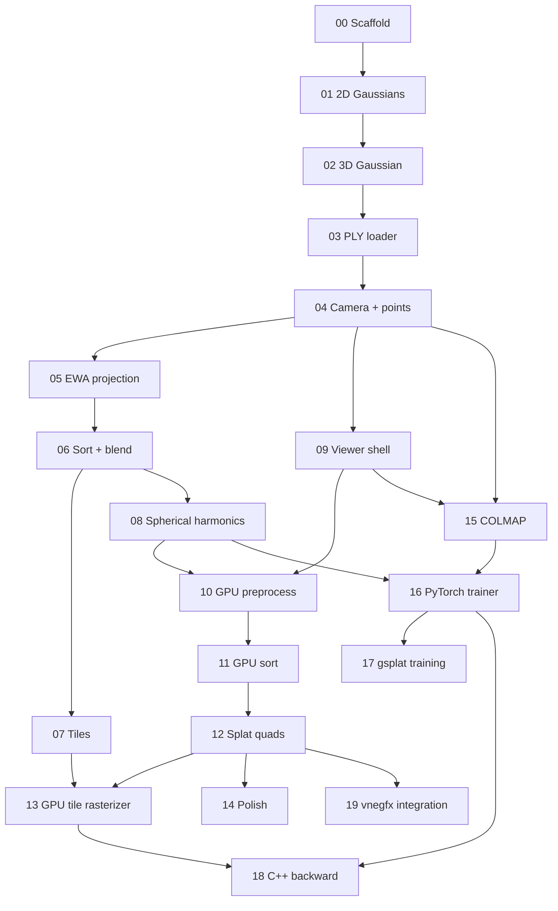

# vne3dgs Learning Roadmap

Learn 3D Gaussian Splatting (3DGS) from zero by building it, one task at a time, on the VertexNova stack.

**New to 3DGS?** Read [learn/overview.md](learn/overview.md) first (one page, ~10 minutes). Keep
[learn/glossary.md](learn/glossary.md) open while you work. Papers, reference code and datasets are in
[learn/references.md](learn/references.md).

---

## Principles

1. **CPU before GPU.** Every formula is first written in plain C++ where you can set a breakpoint.
   GPU shaders are then tested against that CPU code, value by value and pixel by pixel.
2. **Viewer before trainer.** Rendering is most of the math and gives visible results early. Training
   needs the renderer plus gradients.
3. **C++ for rendering, Python for training.** The renderer lives in `vne::gs`. Training starts in
   PyTorch (autograd) in Task 16. The two sides exchange `.ply` files and reference values, nothing else.
4. **Small, testable steps.** Every task ends with tests and an observable "done when".

## Task table

Status key: `[ ]` not started · `[~]` in progress · `[x]` done

### Phase 0 — Setup

| # | Task | Status |
|---|------|--------|
| 00 | [Scaffold the library](tasks/00_scaffold.md) | [x] |

### Phase 1 — One Gaussian, by hand (CPU)

| # | Task | Status |
|---|------|--------|
| 01 | [2D Gaussians and alpha blending](tasks/01_gaussians_2d.md) | [x] |
| 02 | [The 3D Gaussian](tasks/02_gaussian_3d.md) | [x] |

### Phase 2 — Real data

| # | Task | Status |
|---|------|--------|
| 03 | [Read a trained scene (PLY)](tasks/03_ply_loader.md) | [x] |

### Phase 3 — CPU reference renderer

| # | Task | Status |
|---|------|--------|
| 04 | [Cameras and projecting centers](tasks/04_camera_and_points.md) | [x] |
| 05 | [Projecting the ellipsoid (EWA splatting)](tasks/05_ewa_projection.md) | [ ] |
| 06 | [Sort and blend: the first real image](tasks/06_sort_and_blend.md) | [ ] |
| 07 | [Tiles: rehearsing the GPU algorithm](tasks/07_tile_renderer.md) | [ ] |
| 08 | [Spherical harmonics (view-dependent color)](tasks/08_spherical_harmonics.md) | [ ] |

### Phase 4 — Real-time GPU viewer (vnerhi)

| # | Task | Status |
|---|------|--------|
| 09 | [Viewer shell](tasks/09_viewer_shell.md) | [ ] |
| 10 | [Preprocessing in a compute shader](tasks/10_gpu_preprocess.md) | [ ] |
| 11 | [Sorting on the GPU](tasks/11_gpu_sort.md) | [ ] |
| 12 | [Splats as instanced quads](tasks/12_splat_quads.md) | [ ] |
| 13 | [Tile-based compute rasterizer](tasks/13_tile_rasterizer_gpu.md) | [ ] |
| 14 | [Polish (pick-list)](tasks/14_polish.md) | [ ] |

### Phase 5 — Training: where Gaussians come from

| # | Task | Status |
|---|------|--------|
| 15 | [Cameras from photos (COLMAP)](tasks/15_colmap_cameras.md) | [ ] |
| 16 | [A PyTorch trainer you can read](tasks/16_pytorch_trainer.md) | [ ] |
| 17 | [Full-scale training with gsplat](tasks/17_gsplat_training.md) | [ ] |
| 18 | [Your own backward pass in C++ (capstone)](tasks/18_cpp_backward.md) | [ ] |

### Phase 6 — Integration (optional)

| # | Task | Status |
|---|------|--------|
| 19 | [Splats in vnegfx, composited with meshes](tasks/19_vnegfx_integration.md) | [ ] |

## Dependency graph



Tasks 01–08 are strictly sequential. After Task 08 you can go GPU-first (09–13) or training-first
(15–17). Task 18 needs both.

## How to work a task

1. **Read** the task's *Why* and *Learn* sections. Do the worked example on paper.
2. **Read** the listed paper sections or reference code. Each item says what to look for.
3. **Branch:** `git switch -c task/NN-short-name`.
4. **Write the tests first** from the task's *Test* section. Watch them fail.
5. **Write the core function yourself.** Ask Claude to review it, explain a failing test, or
   write the plumbing (CMake, loaders, example harness).
6. **Check "Done when"**, then answer *Check yourself* without looking.
7. **Write *My notes*** in the task file: what surprised you and what you'd explain differently.
   Explaining it back is the fastest way to find gaps.
8. Mark the task `[x]` here, update [gs.md](gs.md) if a module was added, and commit
   (`feat(gs): task NN — <title>`).

## Code layout conventions

Each task names its files. The overall shape the tasks build toward:

```
include/vertexnova/gs/
├── core/        conic.h, gaussian2d.h, front_to_back_blender.h, gaussian3d.h, gaussian_cloud.h, sh.h
├── io/          ply_reader.h, colmap_reader.h
├── camera/      camera.h, conventions.h
└── render/      image.h, projection.h, tiling.h
    ├── cpu/     point_renderer.h, naive_renderer.h, tile_renderer.h
    └── gpu/     (separate target vne3dgs_gpu, depends on vnerhi)
src/vertexnova/gs/...   mirrors include/
shaders/                GLSL sources for the GPU tasks
tests/                  <module>_test.cpp
examples/NN_<name>/     one per task that produces a picture
apps/viewer/            real-time viewer (Task 09+)
python/                 PyTorch training code (Task 16+)
```

The core library `vne::gs` never depends on vnerhi, so it builds and tests headless in CI. GPU code
goes in a separate target (Task 09 decides the details).

## Data you will need

- A **pre-trained scene**, e.g. Mip-NeRF 360 *garden* from the Inria pre-trained models (Task 03 onward).
- The **Mip-NeRF 360 dataset** (photos + COLMAP) for training (Task 15 onward).

Download links: [learn/references.md#datasets](learn/references.md#datasets). Keep data outside the repo
or under the git-ignored `data/` folder.
